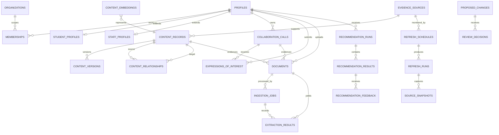

# Production data model

The authoritative schema is `db/schema.ts`; the deployable clean-environment migration is `drizzle/0000_v151_production.sql`.

## Entity-relationship overview

## Main domains

- Identity: `profiles`, `memberships`, `student_profiles`, `staff_profiles`.
  Authentication subject and membership are separate. Student profiles include
  study level, languages, interests, goals, delivery and mobility constraints.
  Staff profiles separate expertise from offered/sought methods, skills and
  facilities. Staff discovery uses `profiles.discoverable` and defaults off.
- Published graph: `content_records`, immutable `content_versions`, `content_relationships`, `evidence_sources`. Public queries require `is_published=1`.
- Staff contributions: `collaboration_calls`, `expressions_of_interest` and module-shaped `content_records` with a pending proposal.
- Documents and ingestion: immutable R2 object reference plus hash, scan,
  review and visibility state in `documents`; provider-versioned processing in
  `ingestion_jobs` and `extraction_results`.
- Governance: `proposed_changes`, `review_decisions`, append-only `audit_events`.
- Recommendations: `content_embeddings`, `recommendation_runs`, `recommendation_results`, `recommendation_feedback`.
- Operations: `refresh_schedules`, `refresh_runs`, immutable
  `source_snapshots`, persistent per-account `rate_limits` and `system_state`.

## Integrity rules

- Foreign keys are enabled in migrations.
- IDs are generated server-side and are never trusted from the browser for ownership.
- Public state and published version are explicit, rather than inferred from UI labels.
- Recommendation scores are constrained to 0–100 and are stored with engine version and actual components.
- A profile/call may submit only one current expression of interest.
- A SHA-256 hash may identify only one uploaded document, preventing renamed
  duplicates from silently entering a review queue.
- Audit rows cannot be updated or deleted by ordinary SQL because migration triggers abort both operations.
- Upload filenames, size, media type, extension and file signature are validated before storage.
- Source refreshes retain response validators and a snapshot hash; unchanged
  sources do not generate proposals.
- Mutation rate limits persist in D1 and therefore apply across Worker
  instances rather than only inside one process.

## Role-permission matrix

| Capability | Public | Student | Staff | Contributor | Reviewer | Administrator |
| --- | ---: | ---: | ---: | ---: | ---: | ---: |
| Browse published graph | Yes | Yes | Yes | Yes | Yes | Yes |
| Edit own student profile | No | Yes | No | No | No | No |
| Edit own staff profile | No | No | Yes | Yes | Yes | Yes |
| Receive recommendations | No | Yes | Yes | Yes | Yes | Yes |
| Submit call/module/upload | No | No | Yes | Yes | No | No |
| Review proposals/documents | No | No | No | No | Yes | Yes |
| View Data Health | No | No | No | No | Yes | Yes |
| Grant memberships/run refresh | No | No | No | No | No | Yes |

The matrix is implemented in `lib/v151/authorization.ts`. Mode selection is absent from the permission calculation.
