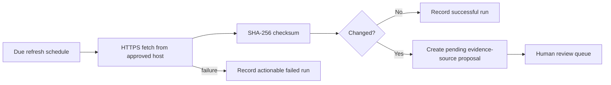

# Data refresh operations

## Workflow

The Worker `scheduled` handler runs `runScheduledRefresh`. Only `https://ingenium-university.eu` and its subdomains are allowed, redirects are rejected, requests time out after 15 seconds, responses are limited to 10 MB and every attempt receives a `refresh_runs` row. Stored ETag/Last-Modified values drive conditional requests; a 304 records a successful unchanged run. A changed checksum creates a proposal; it never edits published academic data directly.

## Schedules

The seed creates weekly schedules for official INGENIUM web sources. `next_run_at` and `last_success_at` are visible in D1. The deployment scheduler cadence must be at least as frequent as the most frequent enabled schedule. An administrator can run due checks through the protected refresh endpoint.

## Failure handling

HTTP errors, timeouts, disallowed URLs, oversize bodies and unexpected failures are stored as `status=failed` with a message. The schedule tracks failure count and last error and retries with bounded exponential backoff from 15 minutes to seven days. Operators inspect these through Data Health. Retry is safe because a run has a unique ID, content is compared by checksum and proposals are review-gated. A production alert destination is not configured; incident contacts are an institutional provisioning input.

## Staleness

`last_verified_at`, source `verified_at`, `last_success_at` and failed-run history allow stale records to be identified. v1.5.1 does not automatically unpublish stale academic content because the appropriate threshold and risk policy require institutional agreement. The Data Health dashboard surfaces the underlying facts.

## Recommendation impact

Approved content is read directly on the next recommendation request. There is no serving cache to invalidate. New approved records receive a new local semantic feature vector. A future queue/cache architecture must make publication, embedding update and cache invalidation one idempotent workflow before it replaces this on-demand path.

## Production runbook

1. Verify clock, binding and scheduler health.
2. Inspect failed runs and source ownership.
3. Review checksum proposals against the official page.
4. Approve only understood structured changes; request changes otherwise.
5. Confirm the public record version and a sample recommendation after publication.
6. Record incidents rather than rerunning until evidence disappears.
