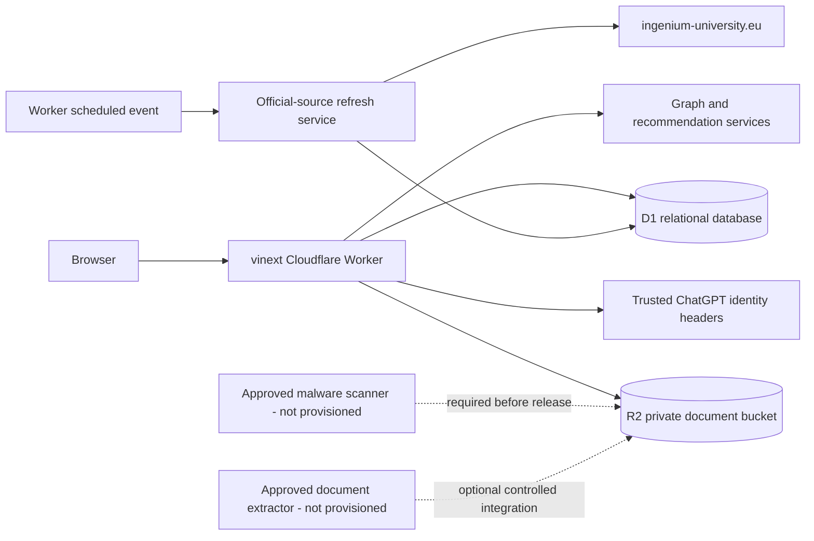

# Production architecture

## Runtime topology

The Worker is the only application tier allowed to access D1 or R2. No database credential, bucket credential or administrator capability is delivered to the browser.

## Request boundaries

- Public page loaders query only `content_records.is_published=1` and published relationships. If no D1 binding exists, the verified v1.5 seed is used as an explicit local/render fallback; private data is never substituted.
- Authenticated endpoints create or retrieve a profile from the trusted identity subject.
- Mode is a display preference. Permissions always come from active `memberships` rows.
- Contribution endpoints validate on the server, write a draft/pending record, create a proposal and append an audit event.
- Review endpoints require reviewer or administrator permissions and prevent self-review.
- Uploads enter an R2 `quarantine/` key and a private D1 document row. Failure to write metadata deletes the object.
- Recommendations query current published candidates, apply hard filters, score deterministically and persist the run, components, reasons and feedback.
- Refresh jobs fetch only HTTPS URLs on the approved INGENIUM host, hash responses and create review proposals when content changes.

## Environments

| Environment | Data | External effects |
| --- | --- | --- |
| Local/test | In-memory SQLite and verified static fallback | None; synthetic fixtures only |
| Staging | Dedicated D1 and R2; seeded public data; approved test accounts | Controlled uploads and source checks |
| Production | Separate D1 and R2 with retention, monitoring and access controls | Requires explicit deployment approval |

Production must never share data or storage with local/test. Staging must not contain unapproved real personal or confidential data.

## Technology responsibilities

| Concern | Implementation |
| --- | --- |
| UI | React 19, Next App Router API/page conventions through vinext |
| Edge runtime | Cloudflare Worker |
| Relational data | D1 SQLite, migration-driven |
| Object storage | R2 private bucket |
| Authentication | Deployment-provided ChatGPT identity headers |
| Authorisation | Server-side role/permission matrix and record ownership checks |
| Semantic representation | Local controlled-taxonomy feature hashing (`taxonomy-hash-v1`) |
| Scheduling | Worker `scheduled` handler |
| Audit | Append-only `audit_events` with update/delete denial triggers |

## Known runtime limitations

- No D1 or R2 resource is provisioned in this repository checkout.
- D1 does not provide PostgreSQL RLS; every new endpoint must use the shared authorisation layer.
- Malware scanning and general PDF/Office extraction require approved integrations and credentials.
- The local feature-hash representation is private and deterministic but less semantically rich than a vetted external embedding model.
- No queue binding is present; recommendation calculation is synchronous and small-dataset appropriate. A queue should be added before high-volume ingestion.
