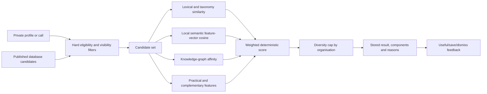

# Recommendation system

Engine version: `ingenium-hybrid-1.0.0`. Semantic representation: `ingenium-local-feature-hash/taxonomy-hash-v1`, 96 dimensions.

## Pipeline

## Recommendation types

- `student_module`: private student profile to published modules, courses and microcredentials.
- `staff_call`: staff expertise and goals to published collaboration calls.
- `call_staff`: a call to opted-in verified staff candidates; only its owner or a reviewer can request it.
- `academic_academic`: one verified staff profile to other opted-in staff profiles.

## Hard filters

Filtering occurs before any score is calculated. Draft, pending, rejected,
archived and closed candidates are excluded. Expired deadlines are excluded.
Student candidates must satisfy declared study-level and language constraints
where both sides provide them. Travel, delivery and timing constraints are
applied where the profile and opportunity provide them. Staff candidates must
have `discoverable=true`. A user-dismissed candidate is excluded from later
runs. A high semantic score cannot reintroduce an ineligible record.

## Candidate generation

At the current alliance dataset size, the server reads the complete eligible published candidate set from indexed relational queries. Candidate representations combine exact structured fields, controlled-taxonomy concept expansion, lexical terms, local semantic feature vectors and graph proximity. This avoids an early dependency on an external vector store while still producing real per-profile rankings. A database full-text index and approximate vector index become useful only when measured candidate volume requires them.

## Scoring

Each type uses a documented 100-point weighting:

| Component | Student → module | Staff → call | Call → staff | Academic → academic |
| --- | ---: | ---: | ---: | ---: |
| Theme/discipline | 22 | 20 | 18 | 15 |
| Method | 0 | 14 | 14 | 12 |
| Goal/need | 16 | 14 | 12 | 12 |
| Language | 10 | 7 | 7 | 6 |
| Mobility/country | 6 | 5 | 5 | 4 |
| Complementarity | 0 | 22 | 28 | 32 |
| Graph affinity | 10 | 8 | 8 | 9 |
| Freshness/deadline | 8 | 6 | 4 | 4 |
| Delivery compatibility | 10 | 4 | 4 | 6 |
| Schedule compatibility | 5 | 0 | 0 | 0 |
| Credit/load fit | 5 | 0 | 0 | 0 |
| Positive feedback | 8 | 0 | 0 | 0 |

Lexical overlap and semantic cosine are fused 55:45 inside
subject/method/goal similarities. Staff complementarity compares one side's
explicit offered skills, methods and facilities with the other side's explicit
sought capabilities; ordinary similarity is not relabelled as
complementarity. Saved recommendations contribute a small positive prior,
while dismissals are a hard exclusion. Results are labelled Strong (75+), Good
(50–74) or Possible (below 50), and low-signal results under 18 are suppressed.
A maximum of two results per organisation prevents one institution dominating
a page; diversity never overrides eligibility.

## Explanation strategy

Reasons are assembled only from non-zero, user-relevant score inputs: shared focus, shared methods, supported goal, complementary need and cross-university connection. Score components and engine version are stored with the result. No free-form model invents a rationale.

## Embedding management

The local vector is deterministic, contains no external API call and expands a small reviewed concept dictionary before feature hashing. The seed creates a vector for every imported record. Approval of a new call or content record regenerates and upserts the vector in the same review workflow. Input hash, provider, model and dimensions are stored. Changing the model requires a new version and full regeneration.

This is intentionally a privacy-preserving baseline, not a claim of state-of-the-art semantic understanding. A future external model requires data-protection approval, provider documentation, retention controls and a complete offline/human evaluation before use.

## Invalidations and retries

Current recommendations are calculated on demand from published rows, so there
is no stale result cache in the serving path. The engine hashes the full private
input, eligible candidate set, graph state, feedback and engine version. An
identical request reuses the matching completed run; a profile edit, publication
change, feedback event or engine upgrade produces a new immutable run. Failed
requests do not expose partial results. High-volume background workers remain a
future scaling step and are not falsely represented as present.
