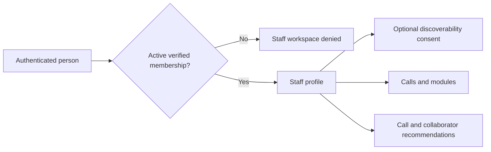
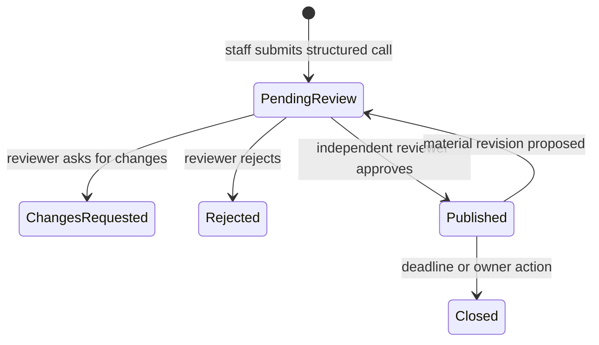
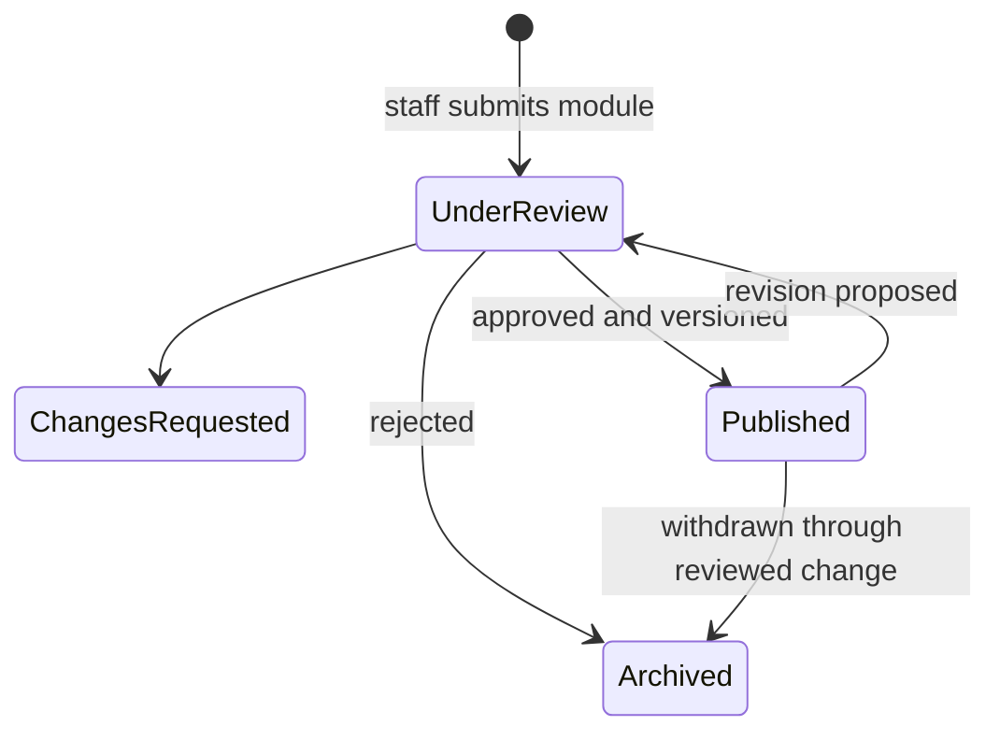

# Staff Mode

Staff Mode lives at `/staff`. It supports controlled academic profiles, collaboration calls, module submissions, evidence uploads, recommendation experiences and status monitoring.

## Access flow

An administrator grants staff, contributor, reviewer or administrator membership after institutional verification. There is no self-promotion path. Mode switching is navigation and never grants a role.

## Academic profile

Staff can store university, title, department, research interests, teaching areas, languages, availability, preferred contact route and collaboration formats. Offered and sought skills, methods, facilities and teaching topics are distinct fields so complementarity can be scored rather than inferred from generic similarity. Discoverability is a separate opt-in checkbox and defaults off. Private contact data is not returned by collaborator matching.

## Call lifecycle

Calls capture title, summary, description, type, disciplines, offered/sought skills, methods and facilities, teaching themes, target partner types, expected contribution, stage, funding, eligibility, countries, delivery/collaboration format, time commitment, dates, location, confidentiality, contact workflow and official source. An expression of interest is recorded inside INGENIUM+ and does not send an email. A contributor can prepare a revision from My submissions; the existing published version remains live until a different reviewer approves the revision.

## Module lifecycle

Modules capture prerequisites, outcomes, skills, campus/location, semester/dates, workload, capacity, recognition and the official application route in addition to core academic metadata. They remain `is_published=0` until initial approval. Each approved payload becomes an immutable version, the public pointer is updated and a semantic feature vector is regenerated. Rejected revisions do not alter the published version.

## Status monitoring

`/api/v151/submissions` returns only the authenticated contributor’s proposals, calls and documents. The workspace shows proposal status and separate scan/review status for uploads.

## Reviewer and administrator areas

- `/staff/review`: pending changes with current-versus-proposed values, authenticated original-evidence download, document decisions and quarantined status; self-review is denied.
- `/staff/data-health`: published/unverified counts, proposal state, document state, refresh runs and recommendation activity.
- `POST /api/v151/admin/memberships`: administrator-only membership grant after first sign-in.

Reviewers can approve, reject or request changes. Production document approval must additionally enforce `scan_status=clean`; the scanner dependency is not provisioned in this checkout, so uploaded documents remain private.
