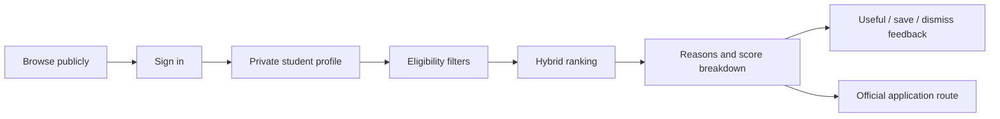

# Student Mode

Student Mode lives at `/student` and retains the same published graph used by public and staff experiences.

## Profile

The private recommendation profile can hold home university, programme, field, study level/year, interests, skills to develop, goals, opportunity types, delivery preferences, languages, preferred countries, travel willingness, semester, schedule constraints and desired credit range. It is not a public student directory. The first authenticated sign-in creates only a student membership. Staff access is never inferred from selecting Staff mode. A successful mode switch persists the display preference but cannot change membership.

## Recommendations

`GET /api/v151/recommendations?type=student_module` reads the current private student profile, stored save/dismiss feedback and current published module/course/microcredential rows. It rejects closed, draft, dismissed, incompatible-level, incompatible-language and online-only travel conflicts before ranking. Subject, goals, language, location, delivery, semester, credit fit, graph proximity, freshness and explicit saves contribute separately. Results contain score, label, components, concrete reasons and engine version. Runs and feedback are stored for evaluation.

The interface says “recommended,” never “eligible,” “enrolled” or “recognised.” Official links and university processes remain decisive.

## Planning boundary

The previous `/my-campus`, `/learning` semester planner and `/my-journey` remain as explicit browser-local utilities for continuity. Persistent Student Mode is the account-backed recommendation area. A future migration may move chosen local saved/plan state only after consent and a tested import path.

## Privacy controls

- Private by default; no public profile endpoint.
- No sensitive traits are collected or inferred.
- Accessibility preferences are stored as private recommendation inputs and never used to expose identity.
- Feedback describes the recommendation interaction only. It does not create an application, enrolment or collaboration claim.
