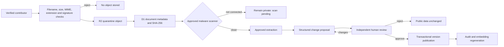

# Upload and review workflow

## Implemented upload controls

- Authenticated staff/contributor permission is required.
- Maximum size is 20 MiB.
- Initial allowlist: PDF, DOCX, XLSX, PPTX, CSV, PNG and JPEG.
- Path separators, traversal, hidden names and control characters are rejected/sanitised.
- Declared MIME, extension and structural signature must agree. PDF EOF markers,
  Office Open XML package manifests, PNG end chunks, JPEG end markers and UTF-8
  CSV decoding are checked in addition to the leading magic bytes.
- SHA-256 is calculated before storage.
- A database uniqueness constraint rejects an identical binary even if it is
  renamed or uploaded through a different form.
- The original object key is under `quarantine/` and metadata records `scanStatus=pending`.
- Database metadata defaults to private/pending. Metadata-write failure removes the object.
- Direct public bucket URLs are never produced.

R2 object keys are immutable by policy convention. Production bucket permissions and versioning/retention must enforce that convention; the application has no overwrite route.

## Scanning and extraction boundary

No approved scanner or extraction provider was supplied. v1.5.1 therefore does
not pretend a scan or extraction occurred. Each upload creates a blocked
`ingestion_job`; the document remains private and `pending` until a trusted
service records a clean scan through the server-only `recordDocumentScan`
boundary. An approved extractor may then record a hash-linked extraction
through `recordDocumentExtraction`. Extraction always produces a proposed
change for human review—it never publishes data directly. These service
functions are deliberately not exposed as public browser routes.

Production provisioning must connect a scanner and extractor with a protected
service identity, verify the original object hash and retain the provider and
engine versions. Confidential documents must never be sent to an unapproved AI
or SaaS provider. Failed scans and extraction attempts remain visible in the
ingestion job and audit history.

## Review

Reviewers see pending proposals, current published values and proposed values
side by side at `/staff/review`. They can open the original evidence using a
short-lived authenticated download route. They cannot approve their own
proposal. Content decisions require a reason and append `review_decisions` and
`audit_events`. Approving a module creates or advances its immutable version
and public pointer. Rejecting a revision preserves the previously published
version. Published calls enter the recommendation candidate set only after
approval, and rejected call revisions likewise leave the live version intact.

Document approval checks `scan_status='clean'` on the server; because the
scanner is absent, the current safe outcome is quarantine. Before an
institutional pilot, the approved extraction service must be connected and the
reviewer must validate the original evidence, the current published values and
the proposed structured change shown in the review interface.

## Rollback

Content versions are retained. Rollback selects a prior reviewed version, records the reason and appends an audit event in one transaction. Uploaded originals are not altered. Object deletion follows approved retention policy, never a publication rollback.
